# WhatToCook ERD

The visual ERD is retained as [capstone erd.jpg](../capstone%20erd.jpg). This source-level ERD records the Phase 6 deliverable schema and is easier to review alongside migrations.

```mermaid
erDiagram
    USERS {
        bigint id PK
        varchar name
        varchar email UK
        varchar password
    }

    PROFILES {
        bigint id PK
        bigint user_id FK
        json health_conditions
        json allergies
        json dietary_restrictions
    }

    FAMILIES {
        bigint id PK
        varchar name
        bigint owner_id FK
        varchar join_code UK
    }

    FAMILY_MEMBERS {
        bigint id PK
        bigint family_id FK
        bigint user_id FK
        varchar role
        varchar status
    }

    HOUSEHOLD_PROFILES {
        bigint id PK
        bigint family_id FK
        bigint user_id FK
        varchar name
        varchar relation
        varchar sex
        date birth_date
    }

    RECIPES {
        bigint id PK
        bigint created_by FK
        varchar name
        text description
        longtext instructions
        varchar meal_type
        int servings
        decimal calories
    }

    INGREDIENTS {
        bigint id PK
        bigint recipe_id FK
        bigint nutrition_food_id FK
        varchar name
        varchar quantity
        varchar unit
    }

    NUTRITION_FOODS {
        bigint id PK
        bigint fdc_id UK
        varchar description
        varchar normalized_name
        varchar source
    }

    PANTRY_ITEMS {
        bigint id PK
        bigint user_id FK
        bigint family_id FK
        varchar name
        varchar quantity
        varchar unit
        date expiry_date
        varchar freshness_status
    }

    SHOPPING_LISTS {
        bigint id PK
        bigint user_id FK
        bigint family_id FK
        varchar ingredient_name
        varchar quantity
        varchar unit
        boolean is_purchased
    }

    MEAL_PLAN_BATCHES {
        bigint id PK
        bigint user_id FK
        bigint family_id FK
        date start_date
        date end_date
        varchar status
    }

    MEAL_PLANS {
        bigint id PK
        bigint user_id FK
        bigint family_id FK
        bigint recipe_id FK
        bigint meal_plan_batch_id FK
        date planned_date
        varchar meal_type
        smallint servings
        varchar status
    }

    RECIPE_FAVORITES {
        bigint id PK
        bigint user_id FK
        bigint recipe_id FK
    }

    RECIPE_REVIEWS {
        bigint id PK
        bigint user_id FK
        bigint recipe_id FK
        tinyint rating
        text review
    }

    MEAL_HISTORY {
        bigint id PK
        bigint user_id FK
        bigint family_id FK
        bigint recipe_id FK
        date prepared_at
        int servings
        text notes
    }

    INGREDIENT_PACKAGE_CONVERSIONS {
        bigint id PK
        bigint user_id FK
        bigint family_id FK
        varchar ingredient_name
        varchar package_unit
        decimal amount_per_package
        varchar amount_unit
    }

    INGREDIENT_CATALOG {
        bigint id PK
        varchar canonical_name UK
        varchar category
        boolean is_approved
    }

    USERS ||--|| PROFILES : has
    USERS ||--o{ FAMILIES : owns
    USERS ||--o{ FAMILY_MEMBERS : joins
    FAMILIES ||--o{ FAMILY_MEMBERS : includes
    FAMILIES ||--o{ HOUSEHOLD_PROFILES : contains
    USERS ||--o{ HOUSEHOLD_PROFILES : may represent

    USERS ||--o{ PANTRY_ITEMS : personal pantry
    FAMILIES ||--o{ PANTRY_ITEMS : shared pantry
    USERS ||--o{ SHOPPING_LISTS : personal list
    FAMILIES ||--o{ SHOPPING_LISTS : shared list

    USERS ||--o{ MEAL_PLAN_BATCHES : creates
    FAMILIES ||--o{ MEAL_PLAN_BATCHES : scopes
    MEAL_PLAN_BATCHES ||--o{ MEAL_PLANS : contains
    USERS ||--o{ MEAL_PLANS : schedules
    FAMILIES ||--o{ MEAL_PLANS : scopes
    RECIPES ||--o{ MEAL_PLANS : planned for

    USERS ||--o{ RECIPE_FAVORITES : saves
    USERS ||--o{ RECIPE_REVIEWS : writes
    USERS ||--o{ MEAL_HISTORY : records
    RECIPES ||--o{ RECIPE_FAVORITES : favorited
    RECIPES ||--o{ RECIPE_REVIEWS : reviewed
    RECIPES ||--o{ MEAL_HISTORY : cooked
    RECIPES ||--o{ INGREDIENTS : contains
    NUTRITION_FOODS ||--o{ INGREDIENTS : matches

    USERS ||--o{ INGREDIENT_PACKAGE_CONVERSIONS : customizes
    FAMILIES ||--o{ INGREDIENT_PACKAGE_CONVERSIONS : shares
    INGREDIENT_CATALOG ||--o{ INGREDIENT_PACKAGE_CONVERSIONS : reference
```

This version keeps the database structure accurate while making the layout easier to read in a document or slide.
